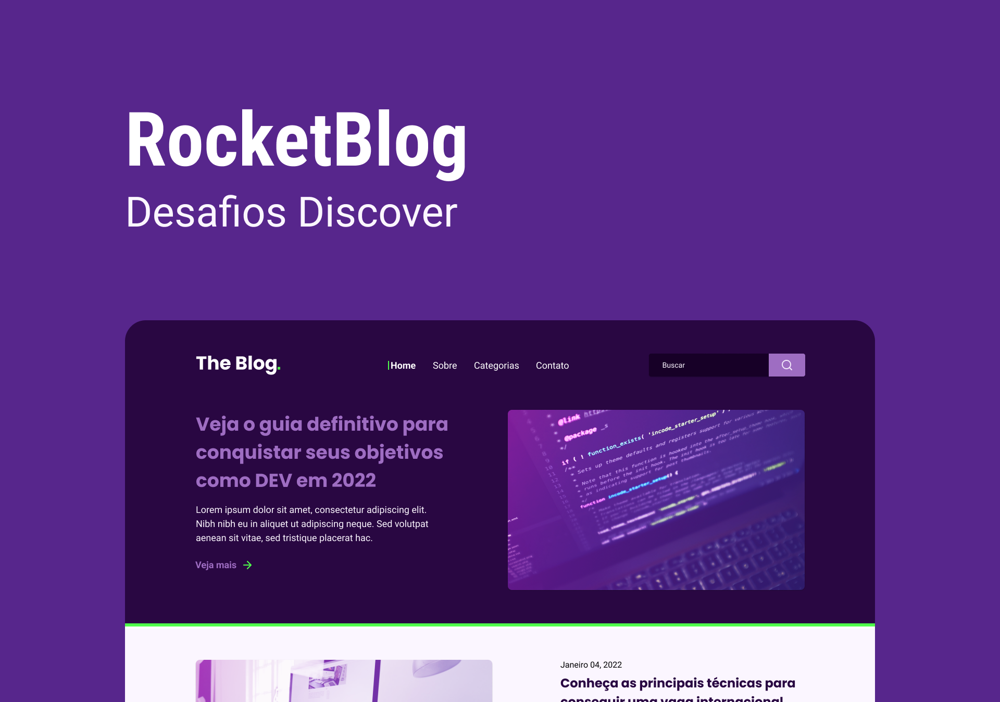
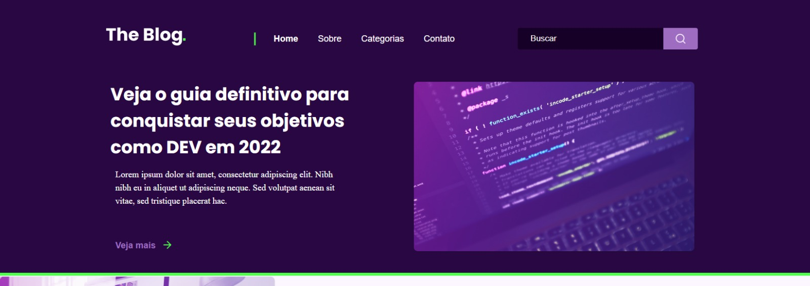
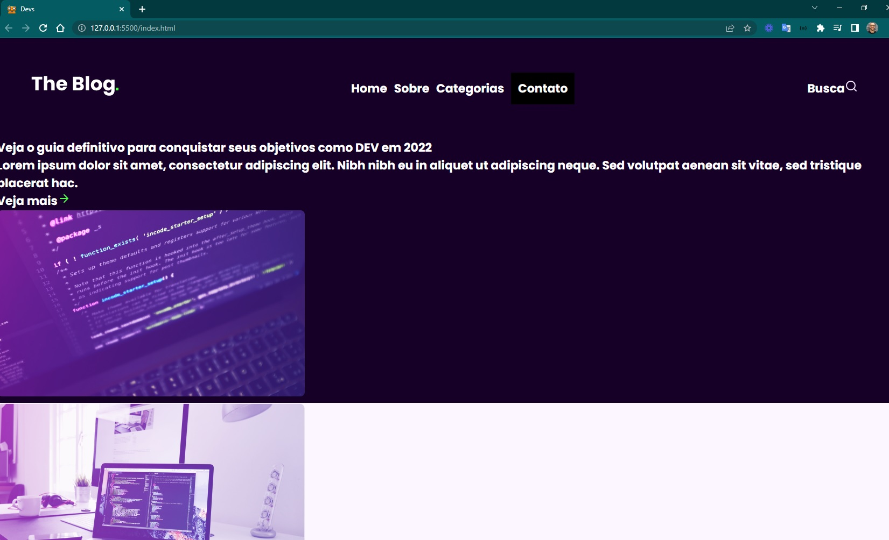
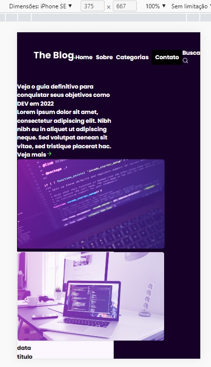

<h4 align="center"> 
	🚧 Rocket Blog 🚀
</h4>

<p align="center" style="display: flex; align-items: flex-start; justify-content: center;">
  
</p>    

### 💻 Sobre o desafio 

Neste desafio você irá desenvolver uma homepage para um blog.

#### 💻 Techs

- Nível de dificuldade: Intermediário
- Tecnologias: html, css

#### 💻 Como começar? 

1 - Use o link do Figma como base para o projeto. Também disponibilizamos para download todos os assets necessários (imagens e ícones), para fazer o download basta clicar no link acima.  

2 - Leia com atenção todas as instruções do desafio.

3 - Bora codar! Lembre-se que você pode usar as tecnologias que se sentir mais confortável, mas também pode se desafiar usando novas techs, fazendo modificações e/ou adicionando funcionalidades no projeto como preferir. 🚀

4 - Compartilhe seu resultado ou tire suas dúvidas na nossa [**comunidade aberta**](https://discord.gg/bacwY2gDCF)  

### 💡 Conteúdos Aplicados

- [x] [O guia estelar de HTML](https://app.rocketseat.com.br/node/o-guia-estelar-de-html)
- [x] [O guia estelar de CSS](https://app.rocketseat.com.br/node/o-guia-estelar-de-css)
- [x] [Posicionando foguetes](https://app.rocketseat.com.br/node/posicionando-foguetes)
- [x] [Formulários de outro planeta](https://app.rocketseat.com.br/node/formularios-de-outro-planeta)
- [x] [Alinhando os planetas](https://app.rocketseat.com.br/node/flexbox)
- [x] [App bonito, até nos textos](https://app.rocketseat.com.br/node/flexbox)
- [x] [https://css-tricks.com/snippets/css/a-guide-to-flexbox/](https://css-tricks.com/snippets/css/a-guide-to-flexbox/)
- [x] [https://css-tricks.com/snippets/css/complete-guide-grid/](https://css-tricks.com/snippets/css/complete-guide-grid/)

### ✅ **Requisitos**


Você pode visualizar o template do projeto no [Figma](https://www.figma.com/file/r4CsL6MPTAvE7EvJXjhFK4/DD-RocketBlog/duplicate). Neste desafio você vai desenvolver uma homepage para um blog.

#### ✅ **Requisitos para o [desafio](https://efficient-sloth-d85.notion.site/Desafio-RocketBlog-807e38809814423e80469b080444db5e):**

- [x] estrutura do html
- [x] header 
- [x] container
- [ ] destaques
- [ ] posts
- [ ] responsividade das divs
- [ ] responsividade das imagens
- [ ] funcionalidade search
- [ ] seção rodá

### 🎨 Style Guide

#### 🎨 Cores
 
```css
:root {
  --purple-bg: #290742;
  --dark-bg: #170027;
  --button-bg: #9e6dc2;
  --white: #fff;
  --light-purple: #fbf6ff;
  --green: #4fff4b;
}
```

#### 🎨 Fontes

- [x] inserir as variáveis de [Google Fonts](https://fonts.google.com/)
- font-family: Poppins. Font Weight: 700
- font-family: Roboto. Font Weight: 400 e 700
 
### 📅 Entrega
 
A ideia é dominar o processo e o fluxo de desenvolver projetos e por isso, listados e descritos as tarefas em readme.

#### 📅 Gestão do projeto

- [x] Organizando os detalhes do projeto no readme.md
- [x] Uma branch main e uma developer, uma branch para cada tarefa
- [x] Favicon

#### 📅 Aperfeiçoar em detalhes

- [ ] [Learn Responsive Design](https://web.dev/learn/design/)
- [ ] [Learn CSS](https://web.dev/learn/css/)

#### 📅 Telas Finais

- Desktop

<p align="center" style="display: flex; align-items: flex-start; justify-content: center;">
   
   
</p>  

- Mobile

<p align="center" style="display: flex; align-items: flex-start; justify-content: center;">
   
</p>  

Feito com ❤️ por Douglas A B Novato. 👋🏽 [Entre em contato!](https://www.linkedin.com/in/douglasabnovato/)
 
Fonte do projeto na [Rocketseat](https://www.rocketseat.com.br/). 👋 Participe da [comunidade aberta](https://discord.gg/bacwY2gDCF)!